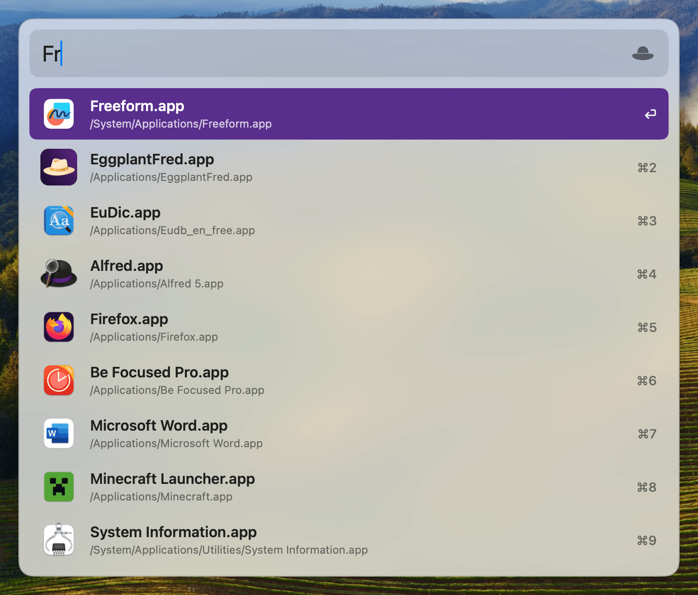

# EggplantFred

Native **macOS 14+** Alfred-style app launcher — menu bar only, SwiftUI + AppKit.

<p align="center">
  
</p>

## Docs

| Doc | Contents |
|-----|----------|
| [docs/commands.md](./docs/commands.md) | Build, run, install, DMG, icons, Accessibility, clean-up |
| [docs/menu-bar-icon.md](./docs/menu-bar-icon.md) | Menu bar `HatGlyph` design spec |
| [docs/app-icon.md](./docs/app-icon.md) | Dock / Finder app icon (rounded corners) |

## Requirements

- macOS 14 or later
- Xcode 15+ (sign with your own Apple Development team)
- [Accessibility](x-apple.systempreferences:com.apple.preference.security?Privacy_Accessibility) permission for the global hotkey (`CGEvent` tap)

## Run

```bash
open EggplantFred.xcodeproj
# or
xcodebuild -scheme EggplantFred -configuration Debug -derivedDataPath build build
open build/Build/Products/Debug/EggplantFred.app
```

On first launch, grant **Accessibility** when prompted (or enable it in System Settings → Privacy & Security). Without it, the global hotkey does nothing.

Release build, install to `/Applications`, and DMG packaging: **[docs/commands.md](./docs/commands.md)**.

## Features

- Menu bar extra (LSUIElement); Dock icon only while Preferences is open
- Global hotkey — default **⌥ double tap**; also ⌃/⇧/⌘ double tap or modifier+key combos
- Type to fuzzy-match installed apps (name + `.app` filename); empty query shows no list
- Compact search bar that expands into a result list (up to 9 rows)
- Open with Enter or **⌘1**…**⌘9**; Esc / click away dismisses
- Alfred-inspired chrome: purple selection, path subtitle, shortcut column
- Preferences via menu bar or the hat icon on the search field

## Project layout

- `EggplantFred/EggplantFredApp.swift` — `@main`, MenuBarExtra, AppState, Accessibility
- `EggplantFred/Controllers/LauncherController.swift` — `NSPanel` show/hide, focus, sizing
- `EggplantFred/Hotkey/` — `CGEvent` tap + shortcut settings
- `EggplantFred/Index/` + `Search/` — app scan + fuzzy search
- `EggplantFred/UI/` — search window, results, prefs, hat glyph
- `EggplantFred/Assets.xcassets/` — App Icon + menu-bar `HatGlyph` PDF
- `docs/` — commands and icon design notes
